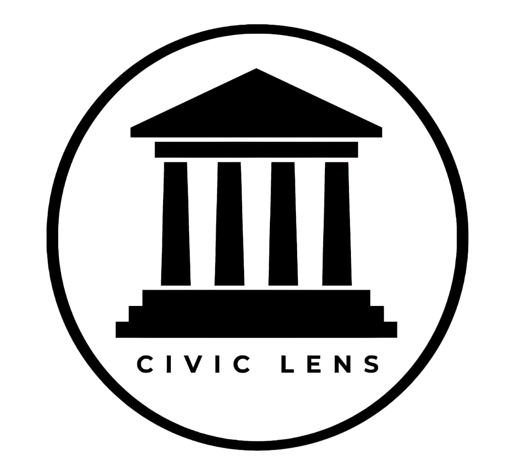

<div align="center">



<br/>
<br/>

# CIVIC LENS
*Citizen Grievance Tracking Platform*


<br/>

<p>
    <a href="https://github.com/1sarthak7/Civiclens-vite"></a>
    <a href="#"></a>
    <a href="#"></a>
</p>

---

## Overview

CivicLens is a specialized civic issue reporting and tracking application designed to bridge the accountability gap between citizens and local authorities. By providing exact GPS coordinates, photographic evidence, and an interactive public dashboard, CivicLens transforms opaque complaint registries into a transparent, citizen-verified resolution environment.

---

## Core Features

| Feature | Description |
|:---:|:---|
| **Live Interactive Maps** | Real-time complaint mapping powered by Leaflet with dynamic marker clusters and categorical visualization. |
| **Evidence Validation** | Secure, direct uploads of photographic evidence paired with immutable timestamp tracking. |
| **Citizen-Verification** | Complaints cannot be closed unilaterally by authorities; citizens must verify the resolution physically and digitally. |
| **Dynamic Reward Engine** | Gamified engagement system awarding credits based on severity, category multipliers, and resolution speed. |
| **Authority Dashboards** | Specialized analytics interfaces providing resolution rate metrics, category breakdowns, and issue heatmaps. |

<br/>

---

## Technical Stack


<br/>
<br/>

---

## Interactive Documentation

<details>
<summary><strong>View Installation Instructions</strong></summary>

<br/>

Clone the repository and install dependencies locally to run the development server.

```bash
git clone https://github.com/1sarthak7/Civiclens-vite.git
cd "civic lens Basic"
npm install
npm run dev
```

</details>

<details>
<summary><strong>View Gamification Architecture</strong></summary>

<br/>

The proprietary gamification engine calculates citizen rewards based on three primary factors:

* **Severity Base Constraint:** Ranging from 5 credits for minor inconveniences to 100 credits for critical safety risks.
* **Category Multiplier:** Priority issues such as road infrastructure and sanitation receive elevated multipliers.
* **Speed Bonus:** Accelerated authority resolutions generate bonus multipliers, incentivizing both rapid reporting and efficient closure.

</details>

---

## Deployment

The application is fully operational and continuously deployed via GitHub Pages. Advanced routing and module bundling is handled natively by Vite, ensuring rapid, caching-enabled asset delivery in production.

---

Copyright 2026 CivicLens. Created by Sarthak and Team.

</div>
